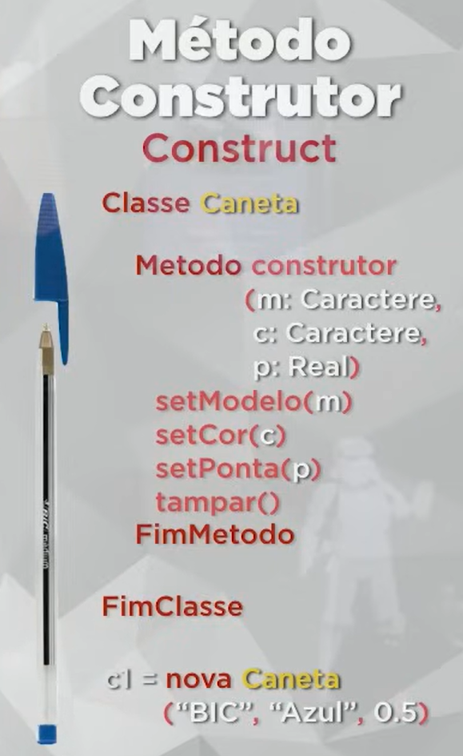

# Getterss 
são métodos que acessam algo, pegam uma informação

Em vez de um cliente pegar uma informação direto na estante
(que seria um problema porque ela estaria acessando algo que não deveria),
ela solicita ao get e ele manda uma informação específica, exemplo as informações dela

-----------------------------------------------------------------------------------------

# Setters
São métodos modificadores que alteram algo dentro do objeto

# Construct
Com o construct não é necessário ficar atribuindo valores manualmente toda vez que
cria um objeto, com ele você pode definir atributos e metódos como uma receita.

O construct tem que ter o mesmo nome da classe

métodos getters e setters devem ser sempre públicos