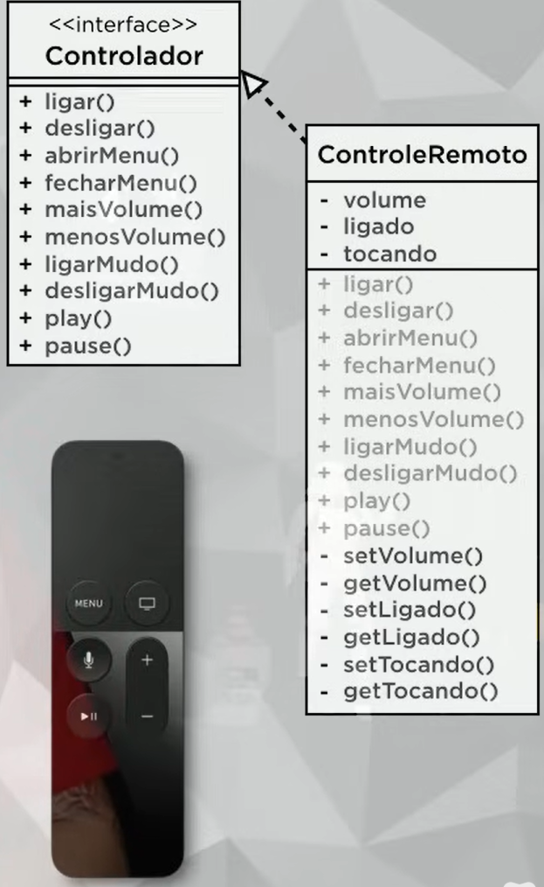

um dos pilares de POO o encapsulamento torna mudanças invisíveis, facilita a reutilização do código
reduz os efeitos colaterais. é como encapsular um objeto e deixar o código dentro e do lado de fora apenas a interface
(você sabe o que faz cada botão mas n sabe como funciona).

 !getters e setters devem ser sempre públicos

# importante!
em vez de colocar public class se coloca public interface
os métodos da interface tem que ser public abstract
interface não tem atributos, apenas métodos e todos públicos +
o funcionamento do objeto tem que ter todos os aributos privados (protegendo a parte interna)